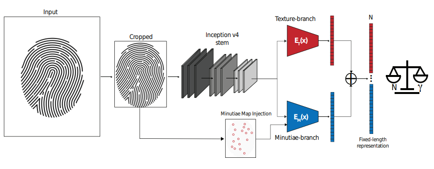
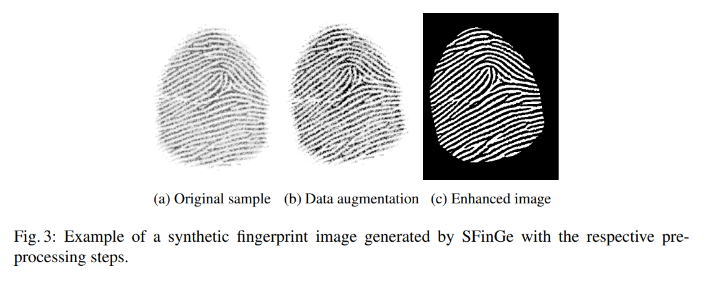
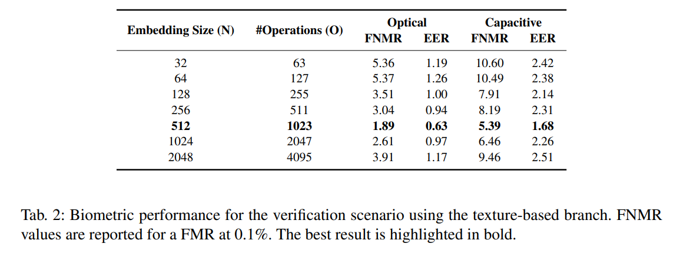

## Disclaimer: There will be major update with refactoring and examples of how to use the software until 17.9.

Implementation of Deep Print, a Deep Learning based fixed-length Fingerprint Representation extractor, and various experiments with such architectures. For scientific background see:

[Benchmarking fixed-length Fingerprint Representations across different Embedding Sizes and Sensor Types](https://arxiv.org/abs/2307.08615)

Paper: Benchmarking fixed-length Fingerprint Representations across different Embedding Sizes and Sensor Types
------------

### Abstract

Traditional minutiae-based fingerprint representations consist of a variable-length set of
minutiae. This necessitates a more complex comparison causing the drawback of high computational cost in one-to-many comparison. Recently, deep neural networks have been proposed to extract fixed-length embeddings from fingerprints. In this paper, we explore to what extent fingerprint
texture information contained in such embeddings can be reduced in terms of dimension, while preserving high biometric performance. This is of particular interest, since it would allow to reduce
the number of operations incurred at comparisons. We also study the impact in terms of recognition
performance of the fingerprint textural information for two sensor types, i.e. optical and capacitive.
Furthermore, the impact of rotation and translation of fingerprint images on the extraction of fingerprint embeddings is analysed. Experimental results conducted on a publicly available database reveal an optimal embedding size of 512 feature elements for the texture-based embedding part of fixed-length fingerprint representations. In addition, differences in performance between sensor types can be perceived.

### Deep Print



The full DeepPrint model consists of the following components:
 - Localization network: Localizes the fingerprint in the image and crops it to a fixed size. (Not shown in the figure)
 - Inception v4 stem: Processes the fingerprint image and extracts a feature map.
 - Texture-branch: Processes the feature map and extracts a fixed-length fingerprint representation.
 - Minutiae-branch: Processes the feature map and extracts a fixed-length minutiae representation as well as a minutia map. The minutia map is used during training to focus the training on the minutiae regions of the fingerprint. It is not used to create the fixed-length fingerprint representation.

In this project, many smaller variants of the DeepPrint model were examined. In the code, the naming convention is:

`DeepPrint_[Loc][Tex][Minu]_<NDIMS>`

Where `[Loc]` means that the localization network is included, `[Tex]` means that the texture branch is included and `[Minu]` means that the minutiae branch is included. `<NDIMS>` is the dimensionality of the fixed-length fingerprint representation (i.e. the number of neurons in the last linear layer).

### Databases

In the code we do not distinguish between different fingers of one subject and different fingers from separate subjects. Instead, we use the term "subject" to refer a distinct fingerprint. The term "impression" refers to a single sample / capture of a fingerprint. This deviates a bit from the terminology used in the paper. In these terms, the databases used in the paper are:

In the paper, a synthetic databases created with the `SFinge` synthetic fingerprint generator were used for training (6000 subjects à 10 impressions) and validation (2000 subjects à 4 impressions).

In addition MCYT330 optical and capacitive sensor databases (3300 subjects à 2 sensors à 12 impressions) were used. The first 2000 subjects were used for training and the remaining 1300 subjects were used for testing.

There is also code to load and benchmark for FVC2004 DB1 and SD4 databases. However, these were not used in the paper.

### Image processing

The input size of DeepPrint is 299x299 pixels. How the resizing and cropping is done depends on the source dataset and can be found in the `flx/data/image-loader.py` file.

During training, data augumentation is applied to the fingerprint images. The following augmentations are applied:

 - Random rotation between -15° and 15°
 - Random translation of up to 25 pixels in x and y direction
 - Random gain and contrast adjustment (see `flx/setup/datasets.py` -> `QUALITY_AUGMENTATION`)

The following preprocessing steps are applied to the fingerprint images before they are fed into the network:



### Training

For training the model, the Adam optimizer is used, the optimal learning rate differs between the individual variants. For simpler variants like `DeepPrint_Tex_512` a higher
learning rate can be chosen to speed up training. For more complex variants like `DeepPrint_LocTexMinu_512` a lower learning rate is necessary to avoid overfitting.
The number of epochs is chosen based on the validation loss. The training is stopped when the validation loss does not decrease anymore.

Depending on the learning rate and model, up to 100 epochs are necessary to train the model. Expect roughly 10-15 minutes per epoch on an A100. As much of the preprocessing
happens on the CPU, a CPU with at least 8 cores is recommended in order to fully utilize the GPU.

### Experiments

#### Embedding size

Different embedding sizes were compared for the DeepFinger variant with only the texture branch (which has lower computational cost than the full DeepPrint model). The results are shown in the following figure:



#### Model variants and sensor types

Different model variants are compared for optical and capacitive sensor types. The results are shown in the following figure:


#### Pose alignment

The impact of pose alignment on the performance of the DeepPrint model was estimated by randomly changing the image pose with increasing magnitude of shifting and rotation:


### Citation

If you use this code in your research, please cite the following paper:

```{bibtex}
@inproceedings{
    Rohwedder-FixedLengthFingerprintDNN-BIOSIG-2023,
    author = {T. Rohwedder and D. Osorio-Roig and C. Rathgeb and C. Busch},
    booktitle = {Intl. Conf. of the Biometrics Special Interest Group ({BIOSIG})},
    keywords = {Fingerprint recognition, computational workload reduction},
    month = {September},
    publisher = {IEEE},
    title = {Benchmarking fixed-length Fingerprint Representations across different Embedding Sizes and Sensor Types},
    year = {2023}
}
```

Using the `flx` package
------------

### Installation

To install the package, clone the repository and run `pip install -e .` in the root directory of the repository.

### Usage

You can import modules from the `flx` package in your own scripts and use them to train models, generate embeddings and run benchmarks.

To learn how to add your own dataset to the package, see the [dataset tutorial notebook](notebooks/dataset_tutorial.ipynb).

To learn how to train a variant of the DeepPrint model on a small example dataset, see the [training example notebook](notebooks/model_training_tutorial.ipynb).


Project Organization
------------

    ├── LICENSE
    ├── README.md          <- The top-level README for developers using this project.
    ├── requirements.txt   <- The requirements file for reproducing the analysis environment
    ├── setup.py           <- makes project pip installable (pip install -e .) so you can  `import flx. ...`
    ├── figures            <- Figures for the README
    ├── models             <- Trained and serialized models, training logs
    ├── notebooks          <- Jupyter notebooks for tutorials and examples
    ├── tests              <- Some unit tests for the package. Run with `pytest`.
    │
    ├── data
    │   ├── benchmarks     <- Folder for the benchmark specifications (i.e. which comparisons to run)
    │   ├── poses          <- Folder for poses of a corresponding fingerprint dataset.
    │   ├── embeddings     <- Output folder for fingerprint embeddings.
    │   └── fingerprints   <- Folder with fingerprint datasets.
    │
    ├── reports            <- Contains folders with the full benchmark results of all trained models
    │   ├── ...            <- Output folders for the benchmark results (in .json format) are here.
    │   └── figures        <- Generated graphics and figures to be used in reporting
    │
    └── flx                <- Source code for use in this project.
        │
        ├── benchmarks     <- Implementation of biometric performance benchmarks (verification, identification)
        ├── data           <- Code to manage datasets of fingerprints, poses, embeddings etc.
        ├── extractor      <- Embedding extraction code using the DeepPrint model
        ├── models         <- DeepPrint model architectures, loss functions and pytorch code for training
        ├── preprocessing  <- Data augmentation and contrast enhancement
        ├── reweighting    <- Code to reweight embedding dimensions after extraction
        ├── scripts        <- Different scripts for running benchmarks, generating embeddings etc.
        ├── setup          <- Settings, predefined models and datasets are defined here. This allows to easily benchmark different models and datasets.
        └── visualization  <- Contains functions for visualization and graphical debugging
     
--------

### Credit to other authors:

- Remi Cadene; Inception v4 pytorch implementation (see `flx/models/Inceptionv4.py`); https://github.com/Cadene/pretrained-models.pytorch

- Dong Chengdong Hang Zhou; iso-19794-2 fingerprint template encoder and decoder (see `flx/data/iso-encoder-decoder`); https://github.com/DongChengdongHangZhou/iso-19794-2-decoder-encoder
